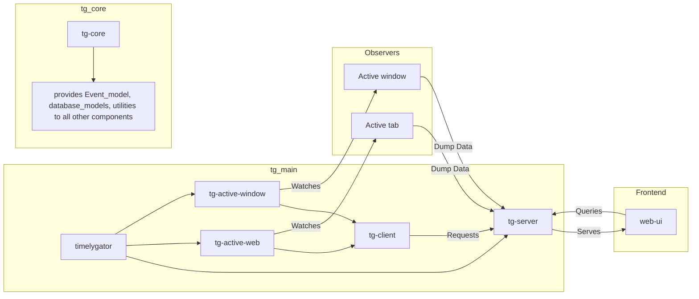
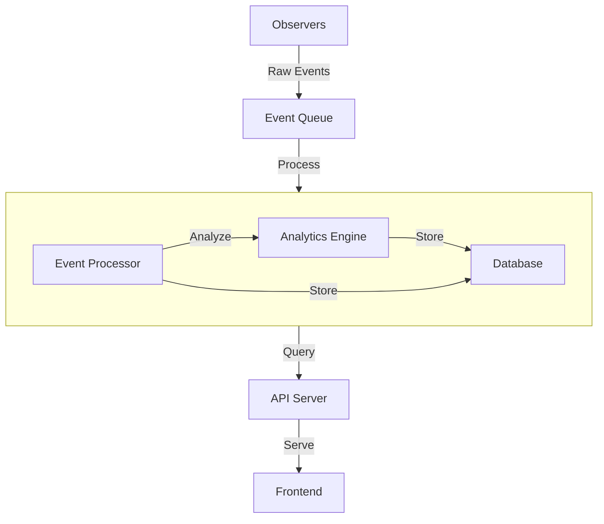

# TimelyGator Backend Architecture

## Overview
The TimelyGator backend is designed as a modular, scalable system that processes and stores time-based activity data from various sources. It consists of several interconnected components that work together to provide a robust data collection and processing pipeline.

## Architecture Components

### 1. Core Components

#### tg-core
The foundation of the backend system that provides:

- Event and database models
- Common utilities and shared functionality
- Core interfaces and abstractions
- Configuration management

#### tg-server
The main REST API server that:

- Handles client requests and authentication
- Processes and stores collected data
- Serves processed data to the frontend
- Manages data aggregation and analytics
- Implements the API endpoints documented in api.md

### 2. Data Collection Modules

#### tg-active-window

- Monitors active window changes on the user's system
- Captures window titles, application names, and timestamps
- Implements efficient event batching
- Handles window focus changes and idle states

#### tg-active-web

- Tracks browser tab activity across supported browsers
- Captures URLs, page titles, and tab states
- Implements cross-browser compatibility
- Handles tab switching and navigation events

### 3. Data Storage Layer

The backend uses a SQLite database with GORM as the ORM layer. Key components include:

#### Database Models

- **Bucket**: Groups related events with metadata
- **Event**: Stores individual activity records with timestamps
- **User**: Manages user accounts and preferences
- **Category**: Handles website and application categorization

#### Data Operations
- Efficient event insertion and retrieval
- Time-based querying and aggregation
- Data cleanup and maintenance
- Backup and recovery procedures

### 4. Processing Pipeline

#### Event Processing

1. Raw events are collected from observers
2. Events are validated and normalized
3. Data is enriched with additional context
4. Events are batched and stored in the database

#### Analytics Engine

- Processes raw data into meaningful insights
- Generates daily and historical reports
- Calculates productivity metrics
- Implements AI-powered analysis (experimental)

### 5. API Layer

The backend exposes a RESTful API that supports:

- Real-time data streaming
- Historical data queries
- User management
- Configuration updates
- Analytics endpoints

## Design Analysis

**Security Considerations:**

* All data is encrypted at rest
* API endpoints require authentication
* Rate limiting on all endpoints
* Input validation and sanitization
* Regular security audits

**Scalability Features:**

* Modular design allows for easy extension
* Event batching for efficient processing
* Configurable data retention policies
* Support for multiple data sources
* Horizontal scaling capability

**Monitoring and Maintenance:**

* Health check endpoints
* Performance metrics collection
* Error logging and alerting
* Automated backup procedures
* Database optimization routines

**Development Guidelines:**

* Clear separation of concerns
* Consistent error handling
* Comprehensive documentation
* Unit and integration tests
* Performance benchmarks

**Deployment:**

* Containerized deployment
* Environment-specific configuration
* Automated deployment pipeline
* Rollback procedures
* Monitoring setup

## Future Considerations

- Support for additional data sources
- Enhanced analytics capabilities
- Real-time processing improvements
- Machine learning integration
- Cross-platform compatibility

---

*This document is part of the TimelyGator backend system documentation. For related information, see the database.md and frontend.md documentation.*
